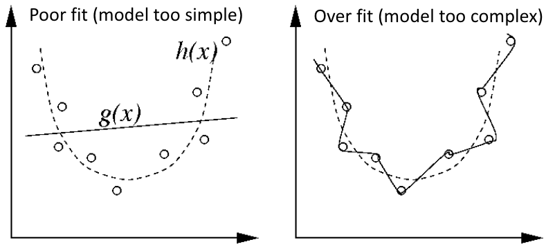
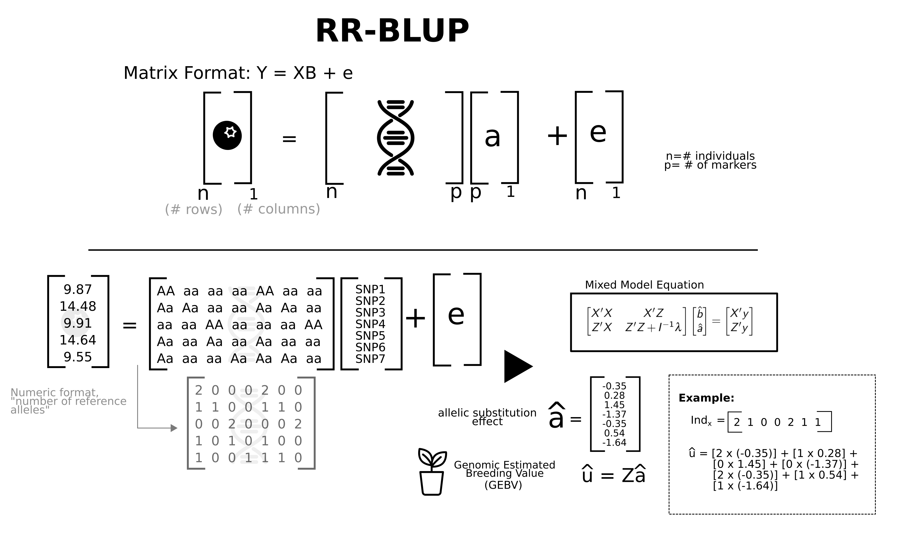
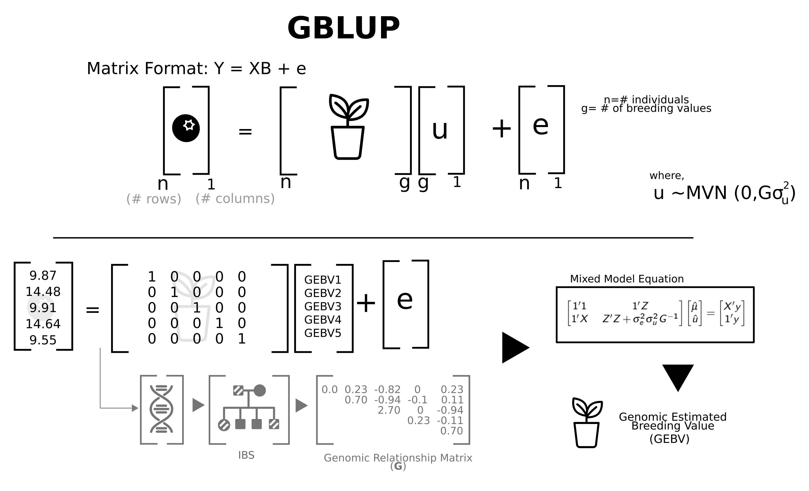
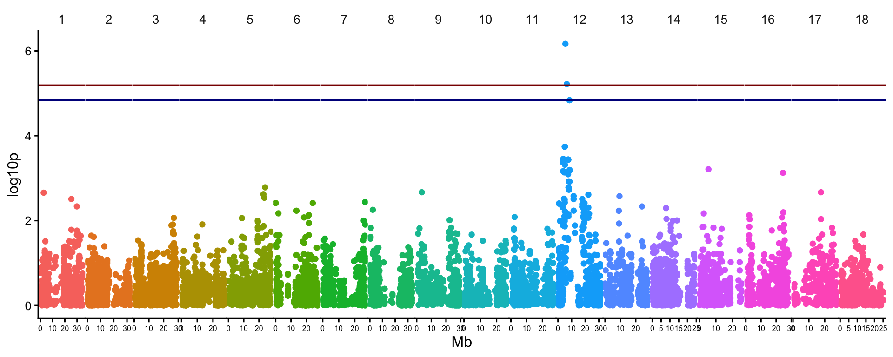
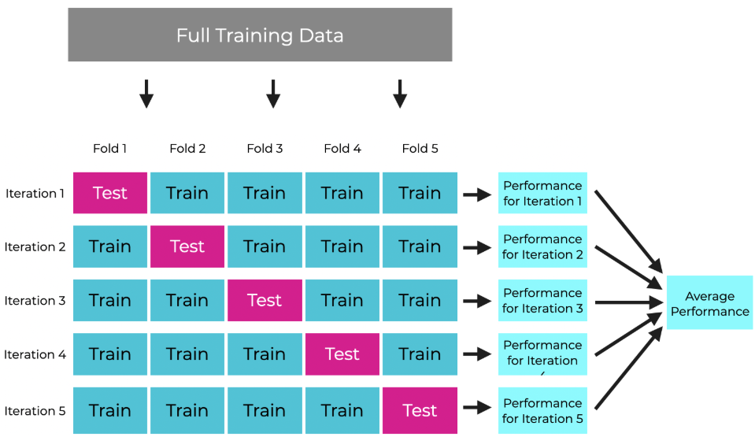
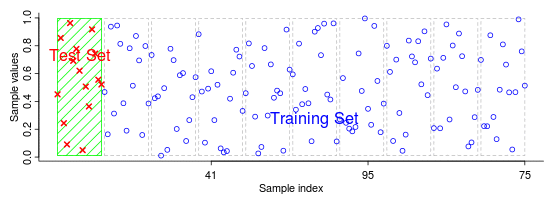

**Previously**: [Partitioning Genomic Variance](9_GenomicHeritability.qmd)

# Lesson Plan

In this lesson, we will learn to:

1.  Fit two-types of genomic prediction models: **RR-BLUP** and **GBLUP**.
2.  Estimate **prediction accuracy** using cross-validation.

# Background

In the previous Module, we learned to localize genetic signals, using genome-wide association scans. Our interest was in **inference** of the location of QTLs.

Sometimes, we want to use genome-wide marker data for **prediction**, to inform breeding decisions, and improve outcomes.

As we have just discussed in lecture, plant (and animal) breeding takes a *long* time. Field trials wherein phenotypic data are generated are expensive and labor intensive. The need for multi-environment testing compounds the challenge and expense of **phenotypic selection (PS)**, especially in the earlier stages of breeding pipelines when the number of entries is large and seed is limited. **Genomic selection (GS)** refers to a form of marker-assisted selection in which genome-wide markers are used with the goal of having at least one marker in linkage disequilibrium with each causal polymorphism.

**Genomic prediction** is the modeling part of the GS process, in which all available and relevant phenotypic and genotypic data are used to obtain predictions of **genomic estimated breeding values (GEBV)** and/or **genomic estimated total genetic value (GETGV)**. Predictions can be obtained regardless of how much phenotypic information is available for an individual, including if there is no data. In this way, various alternative breeding pipeline designs can be unlocked, which **reduce cycle time** and/or **increase selection intensity**. Crucial to any **GS** strategy is the choice of **training population (TP)** for a given **prediction target** (often called the **test set**). The chosen **TP** should be as closely related and representative of the **test set** as possible.

In this lesson, we will focus on learning to implement genomic predictions *and* to assess/compare their accuracy. We will stick to the two most common models and wait until later before exploring extensions and additional models.

There are **two main approaches to genomic prediction**:

1.  SNPs as predictors in\
    **genome-wide marker regressions**

    -   Use marker effects calculated with training data to make predictions

2.  SNPs used indirectly to **measure genomic similarity.**

    -   Use relatedness between training data and prediction target

**N vs. P problem:**

{width="425"}

-   Genomic prediction datasets are almost always P\>\>N. In other words, there are usually many more SNP marker-effects (parameters, **P**) to estimate compared to the number of observations (**N**) to train the model on.
-   Therefore, all **GP** cannot be done with **ordinary least squares (OLS)**. There are not enough degrees of freedom and too much non-independence between predictions to use a fixed-effects framework.
-   Instead, **GP** models use **regularization** procedures:
    -   **Shrinkage**,
    -   **Variable selection**

## Ridge Regression

Recall our [lesson on mixed-models](3_MixedModels.qmd). Predicted values (BLUPs) from random-effects in mixed-models are shrunken towards the mean in such a way as to avoid, or at least minimize over-fitting. If there is missing data, or heterogeneity in the number of observations, BLUPs will shrink values towards the mean. Factor levels with fewer observations will be more shrunken then those with many. Intuitively, this is reflecting our confidence about the prediction when there is more data.

Assume we have a simple multiple-linear regression.

$$y = X\beta + \varepsilon$$

In this model, **X** is a matrix (dimension: N obs. x P markers). In a fixed-effects model, $\hat{\beta}$ is a vector (dim: P markers x 1) of marker-effect estimates.

The **ordinary least square (OLS)** solution for this model is:

$$\hat{\beta} = (X'X)^{-1}X'y$$


To avoid over-fitting, we should instead model our marker-effects as random.

$$\beta \sim N(0,\sigma^2_{\beta}I)$$ We can solve the model with REML.

$$\hat{\beta} = (X'X+\lambda I)^{-1}X'y$$

The shrinkage-factor is:

$$\lambda = \frac{\hat{\sigma}^2_{\varepsilon}}{\hat{\sigma}^2_{\beta}}$$

This model is known as a **Ridge Regression**. In our field, it is known as **RR-BLUP**. Since the things we are actually predicting are marker-effects ($\hat{\beta}$), you can also call this **SNP-BLUP**. **RR-BLUP** represents a model of **infinitesimal** genetic architecture, meaning that all markers have some effect, drawn from a normal distribution with a mean of zero. All markers have some effect, most effects are very small. **RR-BLUP** shrinks marker-effects towards zero, ensuring that marker-effects do not collectively explain more variance than is reasonable.

Supposing we have our vector of SNP-BLUPs ($\hat{\beta}$), **GEBV** for any genotyped individuals can be obtained with:

$$\hat{g} = X\hat{\beta}$$



## GBLUP

The other mode of genomic prediction is to use markers to measure genomic similarity between all genotyped individuals. We'll construct a **genomic relatedness matrix (GRM)** and fit a mixed-model with a random-effect for our experimental genetic unit (e.g. clones or inbred lines). By applying the GRM as a known prior covariance for individuals, we'll be able to distinguish the **GEBV** for all individuals whether they have a lot, little or no phenotypic observations. We learned this model in our lesson on [estimating genomic heritability](9_GenomicHeritability.qmd).

$$y = X\beta + Zg + \varepsilon$$

-   The data vector $y$ has dimension `nObs x 1`
-   $X\beta$ is for fixed-effects like usual.
-   $Z$ is not a matrix of marker-effects like it is for the **RR-BLUP** model above. Instead, it is the design-matrix pointing observations in the data vector $y$ to their corresponding genotype IDs. It should have dimension `nObs x nInd`.
-   $g$ is a vector of BLUPs for the breeding value (so called **GEBV**), and has dimension `nInd x 1`.

The random genetic-effects are distributed:

$$g \sim N(0,\sigma^2_aK)$$

-   The matrices $K$ is the **genomic relationship matrix**.



# Hands-on

Below, you'll find my demo.

Work either with the example **cassava data** or your **project data**.

Once you work through the demo, things you can try:

-   Use cross-validation to test and compare the accuracy for different traits
-   Experiment with the size of the train-test partition. How does smaller vs. larger size train sets influence your estimate of accuracy?
-   Use an alternative software (e.g. GAPIT) to implement cross-validation and genomic prediction. How do those results compare? Aim to understand what can and cannot be accomplished with available packages.
-   Consider how you would model GxE?
-   Could you predict the total genetic value using additive + non-additive effects, following our [genomic heritability lesson](9_GenomicHeritability.qmd)?
-   Install the `BGLR` package and experiment with Bayesian marker-regression models.

# Demo

## Data

Load the cassava genotypes and phenotypes. Same we worked with previously.

```{r, warning=F, message=F, results='hide', echo=TRUE}
library(tidyverse);

ggphenos<-readRDS(file=here::here("data/IITA_2021GS",
                                  "drgblups_forGWAS_geneticgainpop.rds"))

ggsnps<-readRDS(file=here::here("data/IITA_2021GS",
                                "snps_forGWAS_geneticgainpop_reducedset.rds"))

traits<-c("MCMDS","DM","BCHROMO","PLTHT")
```

MAF filter 1%, just like before.

```{r, warning=F, message=F, results='hide', echo=TRUE}
library(ASRgenomics)
ggsnps_filt <- qc.filtering(M=ggsnps,
                            maf         = 0.01, # for a GRM, keep markers with MAF >= 0.01
                            marker.call = 1, # These data are imputed already
                            ind.call    = 1, # These data are imputed already
                            imput       = F)
ggsnps_filt<-ggsnps_filt$M.clean
rm(ggsnps); # on a laptop, memory management may be needed. Remove unfiltered matrix.
```

## Fit RR-BLUP

To fit a bona-fide genome-wide marker regression, we will have to use a package *other* than `asreml`.

Why? My best answer is that ASReml is not optimized for ridge-regressions. For starters, the [`asreml` Manual](https://asreml.kb.vsni.co.uk/wp-content/uploads/sites/3/ASReml-R-Reference-Manual-4.2.pdf) ("Linking a relationship matrix to regressor variables" - Ch. 4, Pg. 69) invites users to fit a **GBLUP** model and then "backsolve" marker-effects because of computational efficiency reasons.

This alone should be instructive on why we might prefer to use **GBLUP** *and* hints at the fact that RR-BLUP and GBLUP can be viewed as two-sides of the same coin, delivering identical predictions and accuracy (see below).

For a RR-BLUP model, we'll use the **sommer** R package. **sommer** comes close to as full-featured as `asreml` and has a somewhat similar syntax to use. Unlike `asreml`, `sommer` is fully open-source. It's main down-side is computational efficiency and memory intensity. As data become very large, `sommer` will slow or even crash.

An excellent alternative would be to use the `mixed.solve()` function in the `rrblup` R package. `mixed.solve()` is a simplified mixed-model solver, requiring the user to specify their own design matrices, but constraining to only single random-effects and no complex residual models.

```{r, eval=F}
install.packages("sommer")
```

Before fitting the RR-BLUP model, let's center the marker matrix.

Centering means subtracting the mean of each column, from the column.

Why do this?

It isn't required. But it can supposedly help REML solvers.

The real reason is that it will result in equivalence to the GBLUP model.

```{r}
ggsnps_filt_centered<-scale(ggsnps_filt,scale = F, center = T)
# This is equivalent to subtracting 2*p from each column of the marker dosage matrix.
```

[**NOTE on correctly indexing your observations (y) to the marker matrix for RR-BLUP models**]{.underline}**:**

-   In our example, we are using a two-stage prediction approach, similar to what we did with GWAS.
    -   Our "phenotype" is a de-regressed BLUP, with a single row for each GID.
    -   This is convenient, since markers live at the genotype level.
-   If we instead wanted a single-stage model (usually superior, but more compute intense), we would have many rows corresponding to a given GID (reps, years, locations).
-   Before regressing phenotype on markers, we must “expand” the genotype-level marker matrix to the observation level using the genotype incidence matrix.

Consider the following way to write a RR-BLUP model:

$$y = ZM\beta + \varepsilon$$

where:

-   M is the genotype-by-marker matrix,

-   Z is the observation-by-genotype incidence matrix,

    -   Notice that the RR-BLUP model does not contain a factor explicitly pointing to genotype IDs. We are responsible to make sure ***y*** and ***M*** line up.

-   ZM is the observation-by-marker marker design matrix.

    -   We have to ensure each observation in ***y*** has a row in ***M***. This matrix multiplication will accomplish that. As mentioned above, it is expanding the genotype-level marker matrix to the observation level using the genotype incidence matrix.

-   To hopefully clarify:

    -   **single-stage, one record per GID**: $Z=I$, so the marker matrix can be used directly just needs to be ordered same as the phenotype vector **y**
    -   **single-stage, repeated records per GID**: build model matrix **Z**, then use **ZM**
    -   **two-stage, one de-regressed BLUP or BLUE per GID**: again $Z=I$ , so direct use of M is fine

-   I bring this up because below we need to ensure that the the order of the SNP-matrix matches the vector of drg-BLUPs.

-   Instead of simply sorting both SNP-marker matrix AND phenotype data in the same order, I will show you a matrix-multiplication approach that is robust to whether using a single-stage or two-stage model approach.

-   We will use `model.matrix()` to make a design matrix indexing observations to GIDs. We talked about this briefly in our [lesson on linear models](2_LinearModels.qmd).

-   The marker matrix has to have the same number of rows as the vector of observations.

-   **y** has dimension **N obs x 1** and **X** is **N obs x N snps**.

```{r, warning=F, message=F, results='hide', echo=TRUE}
# Turn GID into a factor
ggphenos<-ggphenos %>% 
  mutate(GID=factor(GID))

# Re-order the marker matrix to match genotype levels in the data
M<-ggsnps_filt_centered[levels(ggphenos$GID),]

# Create a observation x genotype incidence matrix
Z <- model.matrix(~ 0 + GID, data = ggphenos)
# The ~0 + GID, or equiv. ~ -1 + GID says 
# "Do not include an intercept term in the matrix".

# To help yourself see what is happening, I suggest looking at the contents of Z
## it's just 0's and 1's
## Specifically, in this example, it's a single 1 for each observation since each GID only appears once
## See: 
table(Z)

# Make expanded marker matrix for observation-level RR-BLUP
ZM <- Z %*% M
```

```{r}
library(sommer)
# NOTE on Sommer
### Has some functions that conflict with the dplyr package
## Here's how to mitigate that
library(conflicted)
conflicts_prefer(dplyr::select)
conflicts_prefer(dplyr::filter)

## rrBLUP
fit_rr <- mmes(MCMDS~1,
               random = ~vsm(ism(ZM), buildGu = FALSE), 
               # putting buildGu=FALSE is part of the secret sauce 
               ## avoiding a seriously computational burden involving matrices of dimension p by p.
               data=ggphenos)
```

```{r}
fit_rr$u %>% head
```

```{rE}
summary(fit_rr)$varcomp
```

The contents of `fit_rr$u` should be the BLUPs for the random-effects.

```{r}
fit_rr$u %>% str
```

In this case, it is a vector of marker-effects.

```{r}
fit_rr$u %>% hist(.,main="Distribution of SNP-effects predicted by RR-BLUP")
```

```{r}
# Code below makes a table of snp-effects.
# I am doing this for teaching purposes only...
# To make something like a manhattan plot showing the marker-effects along the genome
# NOTE: no inference or significance testing should/can be done with these effects
snp_effects_table<-fit_rr$u %>% 
  as.data.frame %>% 
  rownames_to_column(var = "SNP_ID") %>% 
  separate(col = SNP_ID,
           into = c("Chr","Pos","Allele1","Allele2"),
           sep = "_",remove = F) %>% 
  mutate(Pos=as.numeric(Pos),
         Chr=factor(Chr,levels=1:18)) %>% 
  rename(SNPeffect=V1)
# snp_effects_table %>% head

# a bit overblown, no real reason to make such a nice plot....
ggplot(snp_effects_table,aes(x=Pos,y=SNPeffect)) + geom_point() + 
  geom_hline(yintercept=0,color='darkred') + 
  facet_grid(~Chr, scales='free_x') +
  theme_classic(base_size = 12) + 
  theme(panel.grid = element_blank(),        # remove grid
        panel.spacing = unit(0, "lines"),    # remove facet spacing
        strip.background = element_blank(),  # remove strip box
        strip.text = element_text(size = 10),
        legend.position = "none",
        axis.text.x = element_text(size=6))
```

SNP-effects from RR-BLUP models should not be used to map/localize QTL signals. Nevertheless, you can still see larger marker-effects appear on Chr. 12, the same place as our QTL for CMD2, which we mapped in the [GWAS lesson](8_IntroGWAS.qmd).



The last thing to do is to compute GEBVs by matrix multiplication of the marker-effects and the marker-genotypes matrix.

```{r}
# Sanity check. VIP that dimensions and ordering of matrices are identical 
## so we multiply the right SNPs against the right SNP-effects.

table(colnames(ggsnps_filt_centered)==rownames(fit_rr$u))

# Matrix multiply SNP matrix against SNP-effects
g<-ggsnps_filt_centered %*% fit_rr$u
```

```{r}
dim(g)
```

```{r}
g %>% head
```

```{r}
summary(g %>% as.vector)
```

## Fit GBLUP

We'll need to make a **GRM** for this.

In our previous less, I showed you how to do this from scratch, and to use a function `kinship()` in the R package `genomicMateSelectR`.

Let's use `A.mat()`, which is part of `sommer()`.

[An important note]{.underline}: Check the manual for `?A.mat`. The input matrix needs to be coded {-1,0,1}. Users need to be aware.

`A.mat()` and `kinship()` will both make a matrix using the formula of Van Raden 2008, Method 1.

```{r}
A<-A.mat(ggsnps_filt-1)
```

```{r}
summary(diag(A))
```

```{r}
dim(A)
```

Also in the previous lesson, we learned to ensure we have a positive definite **GRM**.

```{r}
library(matrixcalc)
is.positive.definite(A)
# Remember the "trick" of "adding a ridge"
A<-A+diag(1e-6,nrow(A))
is.positive.definite(A)
```

Now the mixed model:

```{r}
library(asreml)

# Always make the random-term for GID a factor 
# and set the levels to match the levels of the kinship matrix
# If you have more individuals in the GRM than you have GID in the pheno data
# This will ensure a prediction of _all_ individuals who are genotpyed, 
# including those not phenoptyed
ggphenos<-ggphenos %>% 
  mutate(GID=factor(GID,levels=rownames(A)))

fit_gblup<-asreml(fixed     = MCMDS~1,
                  random    = ~vm(GID,A),
                  data      = ggphenos)
```

## Equivalence of RRBLUP-GBLUP

The last thing to show is that the predictions of GEBV made by RRBLUP and GBLUP are identical.

At least, this is the case because we used a centered marker-matrix for RRBLUP and the kinship matrix computed in `A.mat()`.

```{r}
plot(fit_gblup$coefficients$random,g[,1], 
     xlab="GEBV (GBLUP)",ylab="GEBV (RRBLUP)", main = "RR-BLUP - GBLUP Equivalence"); 
abline(a=0,b=1,col='darkred')
```

We can also convert between the variance components of the two models.

```{r}
summary(fit_gblup)$varcomp
```

```{r}
summary(fit_rr)$varcomp
```

$$\sigma^2_g = \sigma^2_{\beta} \times 2 \sum_1^j p_j(1-p_j)$$

```{r}
# to get allele frequencies, go back to the not-centered matrix of SNPs
p <- colMeans(ggsnps_filt) / 2
c <- 2 * sum(p * (1 - p)) 
var_beta<-summary(fit_rr)$varcomp["ZM:mu:mu","VarComp"]

c * var_beta
```

## Prediction accuracy

One of the most central metrics of a genomic prediction model, is **prediction accuracy**.

The **prediction accuracy** is usually considered as $corr(\hat{g}_{test},y_{test})$. In other words, a measure of the ability of a model to apply to new data not used for training.

You might simply think to look at the $corr(\hat{g_i},y_i)$, i.e. the correlation within the training pop. between predicted value and the dependent variable. This quantity is sometimes called the **prediction ability**, but does not measure ability of the model to generalize. Therefore, **prediction ability** is not what we are usually after; it presents a rosier picture of the model than we want.

Let's compare.

The **prediction ability** of the model:

```{r}
cor(g[ggphenos$GID,1],ggphenos$MCMDS,use='complete.obs')
```

Now let's select a random portion of our population and set it aside as a **test set**. We will re-train our model excluding that **test set** and test [**prediction accuracy**]{.underline}.

```{r}
# QUICK NOTE: Setting "seeds" in R
# What is this?
# Operations in R that sample at "random" from a distribution are not reproducible by default. Each time you run a function like sample() you'll get a diff. result.
# For teaching and research purposes, we often want a reproducible result.
# Setting a "seed" is the answer to this.
## We use set.seed() 
## You can put any number into set.seed. Does not matter. 
## Whatever sample() or similar function you call immediately after set.seed()
## Will produce a repeatable result, as long as you use the same seed.

gids<-unique(as.character(ggphenos$GID))
set.seed(123);
test_gids<-sample(gids,size = 0.2*length(gids),replace = F)
train_gids<-gids[!gids %in% test_gids]

# Subset the phenos to only training set
train_phenos<-ggphenos %>% 
  filter(GID %in% train_gids) %>% 
  mutate(GID=factor(GID,levels=rownames(A)))
  # Notice we aren't going to modify the kinship matrix A
  # It still contains ALL individuals
  # And while only 4/5 of individuals are in training phenos, 
  # we assigned levels=rownames(A)
  ## Internally, asreml will know to construct a model predicting all levels

trn_mod<-asreml(fixed     = MCMDS~1,
                random    = ~vm(GID,A),
                data      = train_phenos)

# We now extract the BLUPs (GEBVs)
## Only for the test set
## Asreml forces us to do some formatting
tst_gebvs<-summary(trn_mod,coef=T)$coef.random %>% 
  as.data.frame %>% 
  rownames_to_column(var = "GID") %>% 
  mutate(GID=gsub("vm(GID, A)_","",GID,fixed = T)) %>% 
  filter(GID %in% test_gids)


tst_gebvs<-tst_gebvs %>% 
  left_join(ggphenos %>% 
  filter(GID %in% test_gids) %>% 
  dplyr::select(GID,MCMDS))
```

Now we can calculate **prediction accuracy** as the correlation between the test-set GEBVs and the de-regressed BLUPs for MCMDS (test-set genetic values).

```{r}
cor(tst_gebvs$solution,tst_gebvs$MCMDS)
```

That's a pretty good result. Note how much lower it is than the so-called **predictive ability**.

## Cross-validation

To assess the **prediction accuracy** of any machine learning model, we want to know how well the model generalizes.

It is not enough to make one training-testing partition. Cross-validation is an iterative procedure of testing a model's ability to predict new data points.

Here are two depictions of cross-validation:

{width="552"}



Two packages that I am aware of off built-in cross-validation functions: `synbreed` and also `gapit`. I also built one into `genomicMateSelectR`.

[**ALTERNATIVE TO THE CODE BELOW**]{.underline}**:** This next part might be a bit much. I decided to try breaking down one way to build a cross-validation function. You've gotta know how to write functions and do loops in R. It is worth learning; maybe this will help. ALTERNATIVELY, you can spend the time with `GAPIT`, `synbreed` or `genomicMateSelectR` and learn to get a cross-validation going using a pre-fab. function. In my research experience, pre-built functions constrain you to particular prediction models and scenarios.

For ultimate control over the scenario you want to test, you need to be able to set-up your own cross-validation procedure. I wanted to show as simple of an approach as possible to implementing a cross-validation procedure "manually" in R. I'll explain as much as possible.

I will use the R package `rsample` which provides functions for tidy re-sampling procedures.

What does the code need to do?

Run multiple iterations of the following procedure. For each iteration:

1.  Take a list of GIDs and split into *k* equal pieces
2.  For each of the *k* pieces, set each piece successively as **test**, the rest as **training**. Predict each **test** with the corresponding **training set** and store the predictions for the **test individuals**.
3.  Combine all **test set** predictions into a vector of all GIDs.
4.  Calculate accuracy for the current iteration as `cor(Predicted,Observed)` across all the GIDs.

```{r}
library(tidyverse)
# First, let's set a few parameters
## These will become input arguments to a function we will build
seed<-123; # for repeatability
nrepeats<-1 # number of iterations
nfolds<-5 # number of folks for k-fold cross-validation
gids<-unique(ggphenos$GID)
blups<-ggphenos
trait<-"MCMDS"
# set.seed(seed);
# seeds<-sample(1:1000,replace = F,size=nrepeats)
```

```{r}
require(rsample)
#nrepeats<-nrepeats; nfolds<-nfolds

# Trick to make the whole set of cross validation repeatable
# The input "seed" is a master "seed" that makes seeds for the rest of the process
set.seed(seed); 
seeds<-sample(1:10000,replace = F,size=nrepeats)

# Make a list of training-testing splits spanning the number of iterations we want to do  
cvsamples<-tibble(repeats=1:nrepeats,
                  seeds=seeds)
         
# For each repeat, us the `vfold_cv` function in rsample 
#### to make train-test splits for k-fold cross-validation   
cvsamples<-cvsamples %>% 
  mutate(splits=map(seeds,function(seeds,...){
                    set.seed(seeds);
                    cvfolds<-vfold_cv(tibble(GID=gids),v = nfolds)
                    return(cvfolds)}))

cvsamples<-cvsamples %>% 
  unnest(splits)

```

```{r, eval=F}
# Watch what happens if we use the rsample functions "training()" and "testing()"
training(cvsamples$splits[[1]])
testing(cvsamples$splits[[1]])
# Basically, it is returning the list of GIDs in each set

# You might want to check out the documentation for vfold_cv and rsample
# Since we chose `nfolds<-5` we now have 5 rows
# The variable "splits" as a special object in it created by rsample
# It's got a list of training-vs-testing GIDs for us
```

The next task is to iterate over each train-test split and actually fit a genomic prediction model.

You can do this with a `for()` loop. I prefer to use functions like `map()` in the `purrr` package (part of the `tidyverse`) because it keeps everything organized within a data.frame.

The loop using `map()` is going to look as simple as this:

```{r, eval=F}
cvsamples<-cvsamples %>% 
    mutate(CVresults=map(splits,~crossVal_onesplit(splits = .,
                                                   data=blups,trait=trait)))
```

But we actually have to make a function `crossVal_onesplit()` to do the prediction.

```{r}
## set the two objects below for function dev and debugging purposes 
# --------------
# data<-blups
# splits<-cvsamples$splits[[1]]
# --------------

crossVal_onesplit <- function(splits, data, trait){
  # Subset the data to training individuals only
  # Use the training() rsample function 
  trainingdata <- data %>%
    dplyr::filter(GID %in% training(splits)$GID) %>%
    dplyr::mutate(GID = factor(GID, levels = rownames(A)))
  # We're doing a GBLUP model.
  # You can set-up whatever you want though.
  fit<-asreml(fixed     = as.formula(paste0(trait,"~1")),
              random    = ~vm(GID,A),
              data      = trainingdata)
  # Extract the GEBVs 
  gpreds <-summary(fit, coef = TRUE)$coef.random %>%
        as.data.frame() %>%
        rownames_to_column(var = "GID") %>%
        dplyr::mutate(GID = gsub("vm(GID, A)_", "", GID, fixed = T))
  # Only the test-set's GEBVs are wanted for measuring accuracy
  gpreds_testsetOnly <- gpreds %>%
      filter(GID %in% testing(splits)$GID)
  # return predictions for testset individuals
  return(tibble(gpreds_testsetOnly = list(gpreds_testsetOnly)))
}
```

Now we can run the function above on our loop with `map()` to predict each of the k test sets in turn.

```{r, results='hide'}
cvsamples<-cvsamples %>% 
    mutate(CVresults=map(splits,~crossVal_onesplit(splits = ., 
                                                   data=blups, trait=trait)))
```

The last thing we need to happen, is to compute prediction accuracy.

We want one correlation between predicted and observed, for each "repeat" (iteration).

```{r}
# Unnest the CVresults which are in a list-column
cvsamples<-cvsamples %>% 
  dplyr::select(-splits) %>% 
  unnest(CVresults) %>% 
  unnest(gpreds_testsetOnly) %>% 
  # merge the blups to the predictions
  left_join(blups)
# Use group_by() + summarize() function to compute the cor(PRED,OBS) 
#### seperately for each _iteration_ (repeat)
accuracies<-cvsamples %>% 
    dplyr::select(repeats,id,GID,solution,trait) %>% 
    group_by(repeats) %>% 
    summarize(accuracy=cor(solution,get(trait),use='complete.obs'))

accuracies
```

And there you have it.

Hopefully, if we wrap this all up into a single function, we'll be up and running our own k-fold cross-validation.

Let's try it.

```{r crossVal function}
# seed<-123; # for repeatability
# nrepeats<-1 # number of iterations
# nfolds<-5 # number of folks for k-fold cross-validation
# gids<-unique(ggphenos$GID)
# blups<-ggphenos
# trait<-"MCMDS"
# rm(seed,nrepeats,nfolds,gids,blups,trait,data)
crossVal<-function(seed, nrepeats, nfolds, gids, blups, trait){
  
  require(rsample)
  
  # Trick for make the whole set of cross validation repeatable
  # The input "seed" is a master "seed" that makes seeds for the rest of the process
  set.seed(seed); 
  seeds<-sample(1:10000,replace = F,size=nrepeats)
  
  # Make a list of training-testing splits spanning the number of iterations we want to do  
  cvsamples<-tibble(repeats=1:nrepeats,
                    seeds=seeds)
  
  # For each repeat, us the `vfold_cv` function in rsample 
  #### to make train-test splits for k-fold cross-validation   
  
  cvsamples<-cvsamples %>% 
    mutate(splits=map(seeds,function(seeds,...){
      set.seed(seeds);
      cvfolds<-vfold_cv(tibble(GID=gids),v = nfolds)
      return(cvfolds)}))
  
  cvsamples<-cvsamples %>% 
    unnest(splits)
  
  crossVal_onesplit <- function(splits, data, trait){
    # Subset the data to training individuals only
    # Use the training() rsample function 
    trainingdata <- data %>%
      dplyr::filter(GID %in% training(splits)$GID) %>%
      dplyr::mutate(GID = factor(GID, levels = rownames(A)))
    
    fit<-asreml(fixed     = as.formula(paste0(trait,"~1")),
                random    = ~vm(GID,A),
                data      = trainingdata)
    
    gpreds <-summary(fit, coef = TRUE)$coef.random %>%
      as.data.frame() %>%
      rownames_to_column(var = "GID") %>%
      dplyr::mutate(GID = gsub("vm(GID, A)_", "", GID, fixed = T))
    
    gpreds_testsetOnly <- gpreds %>%
      filter(GID %in% testing(splits)$GID)
    
    return(tibble(gpreds_testsetOnly = list(gpreds_testsetOnly)))
  }
  
  cvsamples<-cvsamples %>% 
    mutate(CVresults=map(splits,~crossVal_onesplit(splits = ., 
                                                   data=blups, trait=trait)))
  
  cvsamples<-cvsamples %>% 
    dplyr::select(-splits) %>% 
    unnest(CVresults) %>% 
    unnest(gpreds_testsetOnly) %>% 
    # merge the blups to the predictions
    left_join(blups)
  
  accuracies<-cvsamples %>% 
    dplyr::select(repeats,id,GID,solution,trait) %>% 
    group_by(repeats) %>% 
    summarize(accuracy=cor(solution,get(trait),use='complete.obs'))
  
  return(accuracies)
}
```

```{r, results='hide'}
cvresults<-crossVal(seed=123,nrepeats=3, nfolds=5, 
                    gids=unique(ggphenos$GID), blups=ggphenos, trait="MCMDS")
```


```{r}
cvresults
```

Ta da! A working cross-validation function!

That is it for today. 
