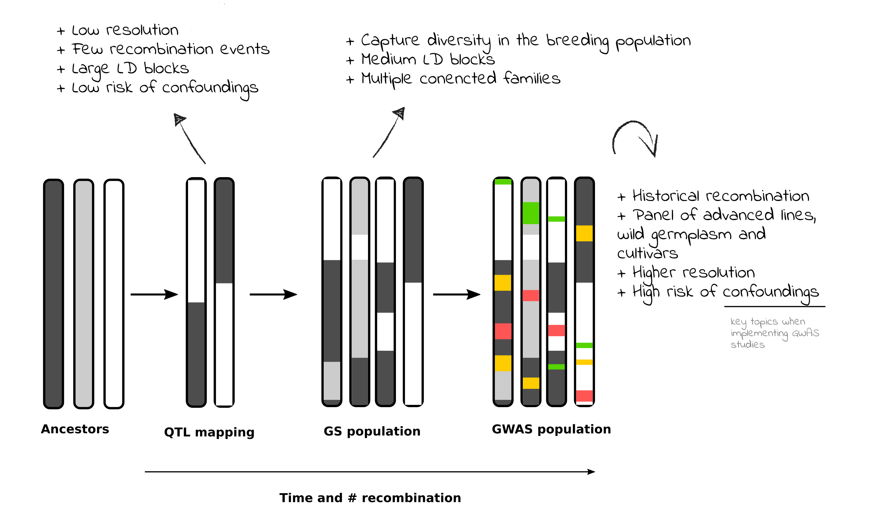
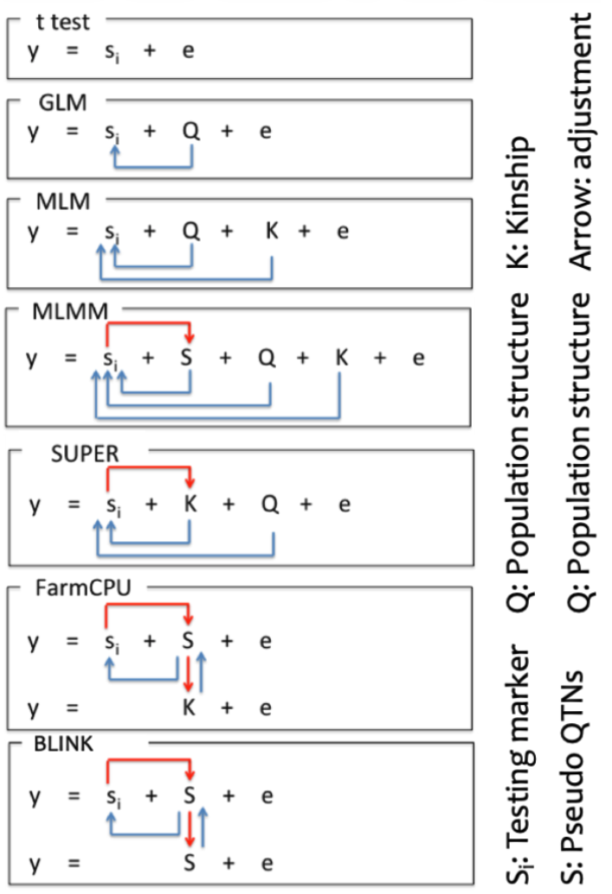
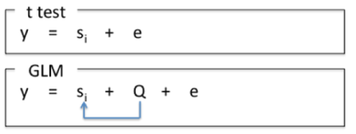
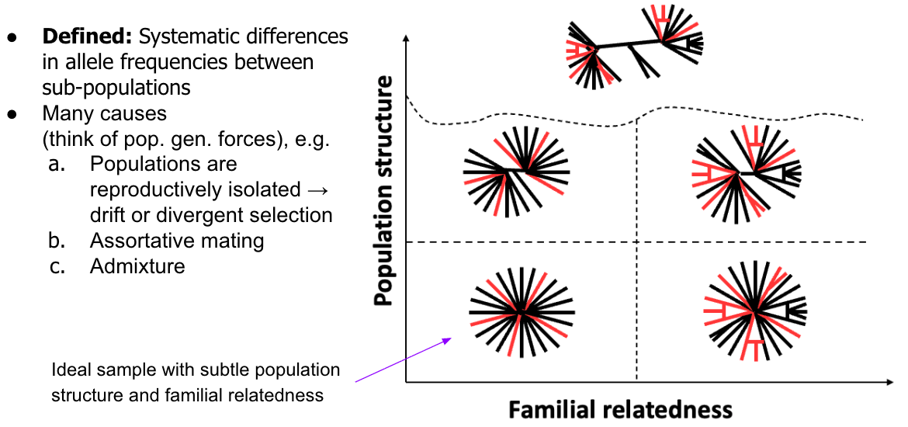
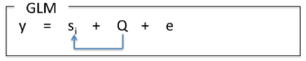
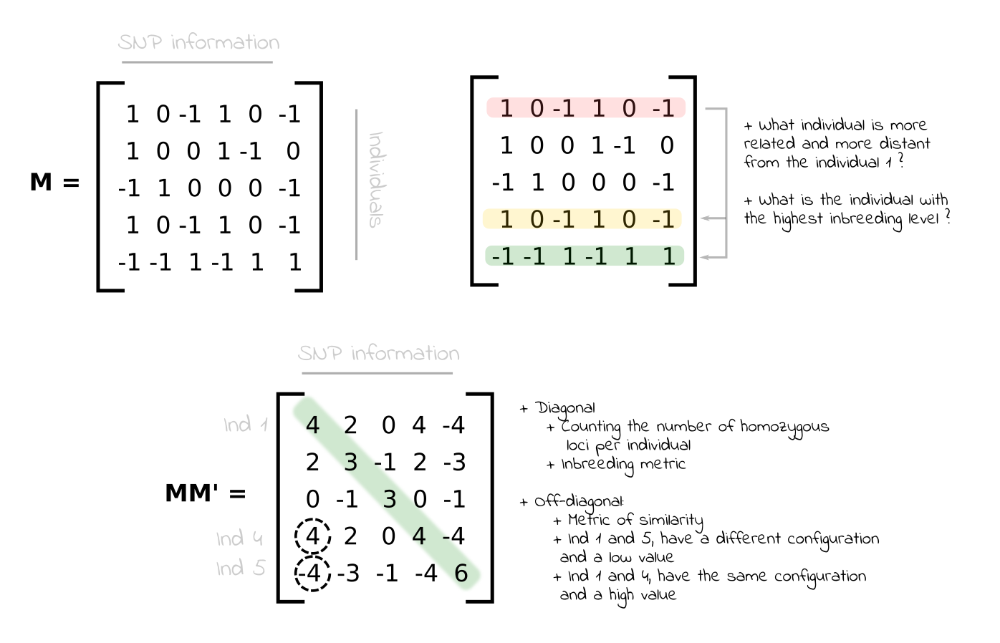
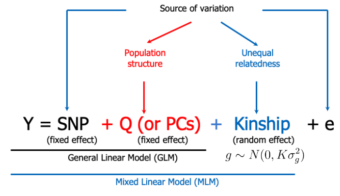
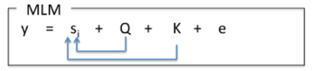
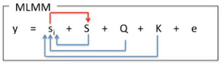
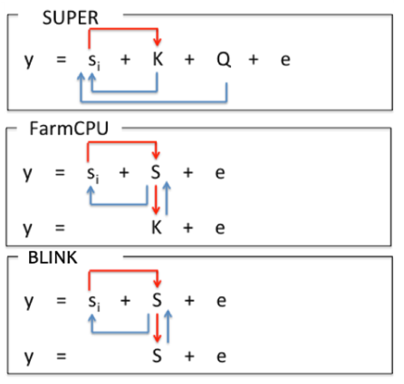

**Previously**: [Modelling Genetic Effects](7_GeneticEffects.qmd)

# Lesson Plan

No additional theory today. We're focusing on getting going with some association mapping!

First, you'll see how to make a GWAS manually, using a loop and basic linear models.

From there, we'll introduce `GAPIT` one of many different software options for GWAS.

In future lessons, given time, I'll share some insights on the ins-and-outs of software alternatives.

# Intro

Today, we will run and compare our first genome-wide association analyses.

We'll use real data from a diverse panel of cassava clones, suitable for GWAS.

As discussed in our lecture session, populations for **GWAS** should be diverse and contain many recombination and mating events. As such, populations used for GWAS experiments differ in several important ways from those used in **Linkage Mapping**, often refered to as **QTL Maping**. The table and figure below provide a quick summary of the key differences.

| Feature | **QTL Mapping** | **GWAS** |
|:-----------------------|:-----------------------|:-----------------------|
| **Population Type** | Biparental populations (e.g., F2, RILs, DH lines) | Natural or diverse populations (e.g., landraces, panels) |
| **Genetic Diversity** | Limited (derived from two parents) | High (multiple genetic backgrounds) |
| **Mapping Resolution** | Low to moderate (due to limited recombination events) | High (uses historical recombination in diverse populations) |
| **Allele Number per Locus** | Typically 2 alleles | Multiple alleles possible |
| **Detection Power** | High for large-effect QTL in controlled backgrounds | High for common variants with moderate to large effects |
| **Control of Population Structure** | Not required (structure is minimal) | Required (to reduce false positives due to structure) |
| **Time and Cost** | Requires population development (time-consuming) | Faster (uses existing populations), but may require high-density genotyping |
| **Application** | Ideal for discovering QTLs in a controlled genetic context | Ideal for studying natural variation and breeding populations |
| **Limitations** | Low genetic diversity; limited to parental alleles | Confounded by population structure, rare allele detection |



\*Table and figure above credit to Dr. Felipe Ferrão.

# What's the best GWAS model?

**Challenge**

-   Every population is different
-   Every experiment exposes slightly different genetic variances
-   Population structure and cryptic relatedness cause confounding that inflate significance, result in false-positives.
-   **small-effect loci** are more common than **large-effects** and statistical tests are less powerful for correctly detecting them
-   **Rare alleles**, especially at **small-effect loci** are the hardest to detect and the least accurately estimated effects.
-   Small population size means less power and more more sampling noise (genetically speaking)
-   Data artifacts: problems like batches in genomic or phenotypic data inflate error and thus reduce power

**So what's the best model?**

-   None.
-   Best tool will be the evaluation of a QQ-plot to assess genomic control.

[**Recommendations**]{.underline}

-   Multiple models
    -   **Understand the differences between the models is VIP**
    -   But not infinite. Plan ahead as much as possible.
    -   It is often said that there is "No Free Lunch".
-   Reliable GWAS studies find multiple lines of evidence, including multiple models all pointing towards the same QTLs.
-   Compare outputs
-   Compare to literature
-   Downstream: seek complementary evidence and validation experiments.

# Model development

-   Two of the most recent models (implemented in GAPIT), FarmCPU (@liu2016) and BLINK (@huang2018) provide useful overviews of the development in GWAS procedures.
-   @tibbscortes2021 provides a recent and useful review of GWAS in plants that goes beyond methods development.
-   Overall, developments proceed along two non-exclusive routes:
    1.  Improve Power ⚡️
    2.  Improve Compute Efficiency ⌛️
-   Non-comprehensive history of model development
    -   @yu2006 - describes the use of mixed-models for population structure control in GWAS
    -   EMMA - Fast REML mixed-model implementation of "Q+K" @kang2008
    -   EMMAX (@kang2010) / P3D (@zhang2010) - functionally equivalent approaches, different software originally. Compute variance components once, then fit marker regressions.
    -   Compressed MLM (CMLM) - speeds up analysis and potentially improves power by reducing the complexity of the kinship matrix, "compressing" individuals into genetic groups based on a cluster analysis (@zhang2010).
    -   Multi-locus mixed-model (MLMM) recognized the need benefit of accounting for sig. markers when testing for sig. of other markers. There is lower power when multiple causal loci exist and especially when causal alleles are in LD (@segura2012).
    -   Additional methods recognize that:
        -   Mixed models lose power when causal SNPs are absorbed into kinship.
        -   Increased computation speed can be found by reducing the number of markers in the Kinship. The following models all have the goal to identify a subset of markers that are "optimal" for controlling structure for the each tested SNP. Custom kinship matrices, essentially. Rather than including already associated markers (termed pseudo QTN) as fixed-effects covariates, authors use them to make a kinship matrix. Methods like sliding windows and LD-thresholds are used to choose markers for inclusion in a given SNPs kinship matrix.
            -   SUPER - @wang2014
            -   FaST-LMM - @lippert2011
            -   @huang2018 (BLINK) and @liu2016 (FarmCPU)

![Genome-wide association study methods for improving computational speed and statistical power. Different methods are grouped by general strategy, and the position of each method shows the general trend of improved statistical power (shown on the x axis) and computational speed (shown on the y axis). CMLM, compressed mixed linear model; ECMLM, enriched compressed mixed linear model; EMMA, efficient mixed-model association; EMMAX, efficient mixed-model association expedited; FarmCPU, fixed and random model circulating probability unification; FaST- LMM, factored spectrally transformed linear mixed models; GEMMA, genome-wide efficient mixed model analysis; K, kinship; MLMM, multi-locus mixed-model; P3D, population parameters previously determined; PCA, principal component analysis; Q, population structure; SUPER, settlement of mixed linear model under progressively exclusive relationship \~Figure 1 from @tibbscortes2021.](images/clipboard-3619711958.png)

{width="420"}

# Hands-on

## Cassava Data

First up, we need some data. Simulations and software tutorial data are fine.

From [2021 Genomic Prediction for IITA Cassava Breeding](https://wolfemd.github.io/IITA_2021GS/index.html). The linked multipage site documents the end-to-end process. It's a long and comprehensive pipeline. Every aspect and the data are all accessible.

I've added a google drive link to our class' CANVAS page under the "Datasets" module. The "**IITA_2021GS**" link will open a Google Drive folder. There are a bunch of different files in there. You can download them all, but the ones you want for starters are:\

-   **Genetic Gain Population**
    -   Phenos: `drgblups_forGWAS_geneticgainpop.rds`
    -   Genos: `snps_forGWAS_geneticgainpop_reducedset.rds`
-   **Full Population** (optional)
    -   Phenos: `blups_forGWAS_FullPop.rds` (all samples, all traits, long-form)
    -   Genos:
        -   `snps_forGWAS_geneticgainpop_reducedset.rds` (all samples, reduced SNP set)
        -   `snps_forGWAS_FullPop.rds` (all samples, all SNPs)

For our benefit here, I've simplified and provided some subsets of the data for sharing. These should run pretty quick on your laptops. Larger SNP sets and larger sample sizes = longer compute.

You can find an R script (`prep_iita_2021_cassava_data.R`) in `code/` documenting the manipulations I did. It's all reproducible!

**What's in the data?**

**Population:** We'll use a population subset labelled "geneticgain". The "Genetic Gain" is a Cassava population made up of \>700 (585 available here) clones spanning decades of Cassava breeding at IITA (@wolfe2017).

**Phenotypes:** In this case, the "phenotypes" you are presented with in this dataset are de-regressed BLUPs. These are essentially BLUEs. It is worth it, as you start doing work with your project data, to review our [coverage of the **two-stage analysis**](5_AdvancedMixedModels.qmd). We don't want to BLUP twice @holland2024.

**Genotypes:** The genotyping was done over many years. Until 2019, we used GBS. Then we switched to DArTseqLD + imputation. The result is a unified SNP set of \~61K genome-wide variants. But we'll start "small". We will also start with about 8K, chosen by LD pruning, instead of 61K SNPs.

**Traits:**

-   **MCMDS:** Season-wide **Mean Cassava Mosaic Disease Severity**, scored on a 1-5 scale where 1 = no symptoms, 5 = worst disease.
    -   In my example, I'll use "MCMDS". Resistance to CMD is known to arise (in this population) mainly because of a single major-effect locus. Since the discovery of a source of resistance in an African landrace in the 1990's, we still don't know the exact causal popymorphism responsible (but see very recent progress @lim2022). The QTL is known as **CMD2** (@wolfe2016).
-   **DM: Dry Matter Content** the percent of total fresh root weight that is dry matter (1-100)
-   **BCHROMO: B-value from a Chromometer**, it is a proxy for beta-carotene levels and measured as part of biofortification efforts. (I think) higher = yellower = more b-carotenoids.
-   **PLTHT: Plant Canopy Height**, cm

## Download and read-in

Note the file pathing below. You can just drop your files into your project `data/` directory. Just be sure to change code to match your path.

```{r}
library(tidyverse);

ggphenos<-readRDS(file=here::here("data/IITA_2021GS",
                                  "drgblups_forGWAS_geneticgainpop.rds"))

ggsnps<-readRDS(file=here::here("data/IITA_2021GS","snps_forGWAS_geneticgainpop_reducedset.rds"))

traits<-c("MCMDS","DM","BCHROMO","PLTHT")
```

```{r}
ggphenos %>% str
```

-   **GID:** Cassava clone name
-   **Year_Accession:** Year clone was first made, dates back several decades
-   **Cohort:** Similar to **Year_Accession**. The "GGetc" cohort is basically the Genetic Gain pop and includes everything before 2013. After 2013, we were using Genomic Selection. There are *several* generations of genomic selection offspring, derived from parents in the Genetic Gain pop, included in the "FullPop" dataset.
-   **Traits:** Just remember that these are de-regressed BLUPs.

```{r}
ggphenos %>% 
  pivot_longer(c(BCHROMO,DM,MCMDS,PLTHT),names_to="Trait",values_to = "Value") %>% 
  ggplot(.,aes(x=Value,fill=Trait)) + geom_density() + facet_wrap(~Trait,scales='free')
```

## Filter SNPs

We won't do much. But as a general rule, due to reduced power, we don't test SNP with less than a 5% minor allele frequency (MAF).

You'll find many GWAS programs, including `GAPIT` (used below) have built in filtering functions.

We're here to learn *not* to let a single R function hand us everything on a plate.

So let's do it manually.

We learned some code to do this [a few lessons ago](6_GenoData.qmd).

```{r}
ggsnps[1:5,1:6]
```

The SNP data is in dosage format already {0,1,2}. This is exactly how `asrgenomics` wants it.

```{r}
library(ASRgenomics)
ggsnps_filt <- qc.filtering(M=ggsnps,
                            maf         = 0.05, # keep markers with MAF >= 0.05
                            marker.call = 1, # These data is imputed already
                            ind.call    = 1, # These data is imputed already
                            imput       = F)
ggsnps_filt<-ggsnps_filt$M.clean
```

## Regression, on a loop

At it's simplest and in its most naive form, GWAS is just a linear (mixed) model, looped over all the SNPs genome-wide.

```{r}
# Create a dataframe with the SNP names
snps_to_test<-tibble(SNP=colnames(ggsnps_filt))

# Now develop the code needed for a function that can be run on a loop

# "SNP" the SNP ID will be our index to loop over the columns of the SNP matrix

SNP<-snps_to_test$SNP[1]

# To fit a model using lm()
## We need the pheno data and the SNP-to-test in a data.frame together
## I'm going to do that one SNP at a time

current_snp<-tibble(GID=rownames(ggsnps_filt),SNP=ggsnps_filt[,SNP])

df<-ggphenos %>% 
  select(GID,MCMDS) %>% 
  left_join(current_snp)

# t-test (an additive model)
fit_current_snp<-lm(MCMDS~SNP,data=df)

results_current_snp<-summary(fit_current_snp)$coefficients %>% 
  as.data.frame %>% 
  .["SNP",] %>% 
  mutate(r2=summary(fit_current_snp)$r.squared)

results_current_snp
```

At this point, we have our first SNP association test.

Next, we'll loop it over all SNP.

But first, consider that, doing it this way, you have full control.

For example, we tested the SNP as a continuous predictor 0,1,2. This captures an additive-type effect.

We used a t-test on the regression coefficient. Totally appropriate. Tests diff. between slope estimate and 0.

What if the trait isn't just additive? I.e. what about dominance?

Option 1: Fit an additive+dominance regression like we did in our [lesson on modelling genetic effects](7_GeneticEffects.qmd).

Option 2: Turn the 0,1,2 into discrete categories (e.g. `as.character(SNP)`), then do the `lm()` model. Use in F-test instead of the t-test. Difference? Asks the question if at least one of the 3 groups (genotype classes) is different from the mean. Slightly different.

```{r, eval=F}
df1<-df %>% 
  mutate(SNP=factor(SNP))

# t-test (an additive model)
fit_current_snp1<-lm(MCMDS~SNP,data=df1)

summary(fit_current_snp1)
anova(fit_current_snp1)

# Notice that the Estimates, p-value (from F-test) and R-sq change slightly 
# Notice also that the result is NOT SIG either way.
```

I hope this gives you a hint of how much variability there can be between the effect-estimates and p-values offered up by the universe of GWAS models and GWAS programs.

**Back to our regression-on-a-loop:** The code below is going to take a few minutes to run. I didn't measure it, but `GAPIT`, for the equivalent model, is decisively faster. Still, it only took a few minutes.

```{r, warning=FALSE, message=FALSE}
# Clean up the R environment
rm(df, df1, fit_current_snp1, fit_current_snp, SNP)
```

```{r, warning=FALSE, message=FALSE, results='hide'}
snps_to_test<-tibble(SNP=colnames(ggsnps_filt))

# for the impatient
# sample 500 SNP
# snps_to_test<-tibble(SNP=colnames(ggsnps_filt)[sort(sample(1:ncol(ggsnps_filt),size = 500, replace = F))])

my_lm_gwas<-snps_to_test %>% 
  mutate(lmFit=map(SNP,function(SNP){
    current_snp<-tibble(GID=rownames(ggsnps_filt),SNP=ggsnps_filt[,SNP])
    df<-ggphenos %>% 
      select(GID,MCMDS) %>% 
      left_join(current_snp)
    # t-test (an additive model)
    fit_current_snp<-lm(MCMDS~SNP,data=df)
    results_current_snp<-summary(fit_current_snp)$coefficients %>% 
      as.data.frame %>% 
      .["SNP",] %>% 
      mutate(r2=summary(fit_current_snp)$r.squared)
    return(results_current_snp)
    }))
my_lm_gwas<-my_lm_gwas %>% unnest(lmFit)
```


```{r}
my_lm_gwas %>% head
```

Now let's make a home-cooked Manhattan plot.

```{r, fig.width=10, fig.height=4}
for_manhattan<-my_lm_gwas %>% 
  separate(SNP,c("Chromosome","Position","REF","ALT"),"_",remove = F) %>% 
  mutate(Chromosome=factor(Chromosome,levels = 1:18),
         Position=as.integer(Position),
         Mb=Position/1000000,
         log10p=-log10(`Pr(>|t|)`))

for_manhattan %>% 
  ggplot(.,aes(x=Mb,y=log10p,color=Chromosome)) + geom_point() + 
  facet_grid(~Chromosome, scales='free_x') +
  theme_classic(base_size = 12) + 
  theme(
    panel.grid = element_blank(),        # remove grid
    panel.spacing = unit(0, "lines"),    # remove facet spacing
    strip.background = element_blank(),  # remove strip box
    strip.text = element_text(size = 10),
    legend.position = "none",
    axis.text.x = element_text(size=6)
  )
```

## GAPIT

Genome Association and Prediction Integrated Tool (GAPIT) and it's relative TASSEL

GAPIT's GitHub page is [here](https://github.com/jiabowang/GAPIT/tree/master?tab=readme-ov-file). [The GAPIT home page](https://zzlab.net/GAPIT/) is the best place to start.

The **user manual** comes as a PDF. I recommend you study it. It also helps to grab the **tutorial data** as you can see the what the different data formats need to look like.

Here's how I installed it:

```{r, eval=F}
devtools::install_github("jiabowang/GAPIT", force=TRUE)

# While you are at it, install qqman, which has convenience functions for
### you guessed it, qq-plots
### also Manhattan plots
install.packages("qqman")
```

In many ways, GAPIT provides extreme convenience and accessibility for a large number of model options.

This is the main reason I choose it here.

However, with convenience is sacrified much flexibility. You will not always have access to all the model parameter settings, for example.

Things to know:

-   GAPIT is open source and is pretty well known / accepted in the literature.
-   Despite this, it's documentation is not the most thorough or clear (my opinion only).
-   GAPIT performs lot's more analyses than GWAS it can do, many of which it does automatically
    -   For example, if you don't provide a Kinship matrix, even if doing a **GLM**, it will compute one
-   If you don't say `PCA.total=0`, and you don't supply PC-scores as covariates, it will compute the PCA for you.
-   If you don't do `file.output=F` it will write files including plots of LD and more to your working directory
-   There are integrated plotting functions, supposedly interactive ones. I won't use those below, but you might want to check them out.

**Formatting our data for GAPIT:**

**Numeric Genotype Format:** One file contains the genotypic data, and the other contains the chromosome and base pair position of each SNP. These are passed to GAPIT through the “GD” and “GM” arguments.

**GD:** Numeric genotype data (GD) in a data.frame. Values encoded as (0,1,2). First column = IDs for individuals, label to match the phenotype data.frames name for this. (GAPIT uses "taxa"). Rest of columns are SNPs. SNP names are column names.

**GM:** Map information (GM) in a separate data.frame/tibble Columns: SNP = same IDs as in columnames of GD Chromosome (int) Position (int)

**Phenotypes are a simple data.frame**. Column 1 = IDs for the individuals (varieties, genotypes, clones, etc.) Rest of the columns are Traits.

Note that there are OTHER options for input, particularly of the genotype data.

```{r}
library(GAPIT)
# Phenotypes
## Note that if you give GAPIT multiple trait columns, it will loop over and analyze each of them.
myY<-ggphenos %>% 
  as.data.frame %>% 
  select(GID,MCMDS)
## SNP data needs a bit of adjustment. First column (not rownames) must be GIDs
myGD<-ggsnps %>% 
  as.data.frame %>% 
  rownames_to_column(var = "GID")
## Map information
## For our SNP data, the Chrom and Position can be extracted from the SNP_ID itself
myGM<-tibble(SNP=colnames(ggsnps)) %>% 
  separate(SNP,c("Chromosome","Position","REF","ALT"),"_",remove = F) %>% 
  select(SNP,Chromosome,Position) %>% 
  mutate(Chromosome=as.integer(Chromosome),
         Position=as.integer(Position))
```

## GLM with GAPIT



`model = "GLM"` can be fit with `PCA.total=0` to get a completely naive regression model. One SNP at a time, no covariates whatsoever.

```{r, message=F, warning=F, results='hide'}
# After running the code below
# Take a moment to review the console output.
# GAPIT is very "talkative" and tells you all about what it's doing.

glm<-GAPIT(model = "GLM",
           Y = myY,GD = myGD, GM = myGM,
           PCA.total = 0,
           SNP.MAF = 0.05, # let GAPIT do the MAF filtering for us
           file.output=F) # Ask GAPIT not to output files
              # You may want to activate file output.
              # Some outputs might not be stored in the R-object and only on disk
              # Anything GAPIT does store, will be in your RAM memory / R env.
              # For huge numbers of markers, that could be a big problem.
```

```{r}
glm$GWAS %>% head
```

### Examine the output

To understand GWAS better, look at histograms, plots and/or correlation matrices: How are things like marker-effect, MAF, p-value and PVE (r-squared) related to each other?

```{r}
glm$GWAS$P.value %>% -log10(.) %>% hist
```

## Manhattan plots

```{r}
library(qqman)
glm$GWAS %>% 
  manhattan(.,chr = "Chromosome",bp = "Position ",p = "P.value")
```

## Significance thresholds

Notice that `qqman`'s Manhattan plot has a red and a blue line, indicated a threshold. These are default values. To set them correctly, we need to specify a sigificance threshold.

We need to decide a p-value that satisfactorily minimizes the rate of false-positives due to multiple testing.

At an $\alpha=0.05$, if we tested 7802 markers then 390 of them are probably Type I errors.

Recall from lecture that there are (at least) two types of multiple-test corrections.

**Family-wise error rate (FWER) using the Bonferroni correction:** Asks what threshold makes the probability of even one false SNP across the entire genome ≤ 0.05?

$$\alpha_{Bonf} = \frac{\alpha}{m}$$ So:

```{r}
m<-ncol(ggsnps_filt)
alpha<-0.05
bonf<-alpha/m
bonf
```

**False Discovery Rate (FDR) control using the Benjamini-Hochberg (BH) procedure:** Controls the proportion of false positives among declared discovered (rejected null hypotheses).

1.  Sort p-values ascending
2.  Assign them a rank index 1:m
3.  Choose your target FDR rate, q
4.  Find the largest p-value that is equal or lesser than $\frac{k}{m}q$.
5.  All p-values below the one defined in Step 4 are declared significant.

Here's some R code to calculate it:

```{r}
bh_threshold<-function(p,q=0.05){
  p_sorted <- sort(p)
  m <- length(p_sorted)
  k <- max(which(p_sorted <= (seq_len(m) / m) * q))
  bh<-p_sorted[max(k)]
  return(bh)
}

bh_fdr5<-bh_threshold(p=glm$GWAS$P.value, q = 0.05)
bh_fdr5
```

Pretty different stringency level, right?

Let's replot with the correct thresholds.

```{r}
library(qqman)
glm$GWAS %>% 
  manhattan(.,chr = "Chromosome",bp = "Position ",p = "P.value",
            suggestiveline = -log10(bh_fdr5), genomewideline = -log10(bonf))
```

Regardless of threshold, it looks like a huge number of markers across the genome are "significant".

## QQ plots

It remains for us to examine a quantile-quantile plot of the p-values.

This is one of the most important tools in for diagnosing the results of a GWAS.

Without population structure control, and with a too lax threshold, we might see wildly inflated significance levels.

Under null (no true associations), p-values follow a Uniform (0,1) distribution. That means all values b/t 0 and 1 are equally probable.

A qq-plot of p-values is basically plotting actual vs. expected p-values.

Simply sort the actual p-values and plot on y. Sample from a uniform(0,1), sort and plot on x. Add a 1:1 line. Most p-values should fall along the 1:1 line.

```{r}
qq(glm$GWAS$P.value)
```

Here's all qqman really does with your p-values

```{r, eval=F}
observed = -log10(sort(pvector, decreasing = FALSE))
expected = -log10(ppoints(length(pvector)))
```

```{r}
glm$GWAS %>% 
  arrange(P.value) %>% 
  select(SNP,P.value) %>% 
  mutate(ExpectedP=-log10(ppoints(nrow(.))),
         ObservedP=-log10(P.value)) %>% 
  ggplot(., aes(x = ExpectedP, y = ObservedP)) +
  geom_point(size = 2) +
  theme_classic() + 
  geom_abline(intercept = 0, slope = 1, color = "darkred") +
  labs(title = "QQ Plot of P-values", x = "Expected -log10(p)", y = "Observed -log10(p)") 

```

## Confounding effects

From the QQ plots, you can see that our p-values are massively inflated.

This is a strong indication that population genetic structure is confounding our results and causing inflation of genome-wide marker-trait association.



### Population structure



The fixed-effect covariate (denoted Q) could take on various forms. The most common is to use PC-scores; projects of individuals onto the 1 or more of the top eigenvectors (principal components) from a PCA on the SNP data.

#### PCA

In our [exploration of genomic data lesson](6_GenoData.qmd), you learned how to do this with `ASRgenomics`.

`GAPIT` is going to make these computations for us automatically.

Nonetheless, understand that the PCA can be computed externally and then fed into `GAPIT`.

Let's do it with `prcomp` .

```{r}
# Run PCA
pcs <- prcomp(ggsnps_filt, center = TRUE, scale = TRUE) 

summary(pcs)$importance[,1:10]

# Calculate proportion of variance explained
explained_var <- (pcs$sdev)^2 / sum(pcs$sdev^2)
explained_var_pc1 <- round(100 * explained_var[1], 1)
explained_var_pc2 <- round(100 * explained_var[2], 1)

pcscores<-pcs$x %>% as.data.frame

pcscores %>% 
  ggplot(.,aes(x=PC1,y=PC2)) + geom_point() + 
  labs(x=paste0("PC1 (", explained_var_pc1, "%)"),
       y = paste0("PC2 (", explained_var_pc2, "%)"),
       title = "PCA SNP matrix")
```

The "Q-matrix" you need to feed into `GAPIT`, if doing things manually, is one of the pcscores:

```{r}
pcscores[,1:5] %>% head
```

#### ADMIXTURE

This is not an R-based software and I do not have a demo for this ready.

However, if you want to try with our data (or your data), [start here](https://speciationgenomics.github.io/ADMIXTURE/).

### Relatedness

Beyond the deeper divisions within a GWAS population that we call **population structure** there may be further heterogeneity in relatedness. In other words, cryptic relatedness often exists within as well as among sub-populations. Using PC-scores in a model isn't always sufficient.

In class, we talked briefly about using pedigree vs. marker data to calculate a **kinship matrix (K)**, also called a **genomic relatedness matrix** **(GRM)**. This matrix will measure the pairwise similarity in the genomes of all the individuals in our population. Basically, a covariance matrix based on the SNP data as variable. The **GRM** is a critical piece of **genomic prediction** and **selection** methods as well, so we are going to come back to it.



`GAPIT` is going to automatically compute this for us. The exact formula differs slightly from the image above. Specifically, the most common matrix is Method 1 from @vanraden2008.

The marker matrix **M** should be centered, like so:

$$
z_{ij} \;=\;
\begin{cases}
2 - 2p_j, & A_1A_1\\
1 - 2p_j, & A_1A_2\\
0-2p_j,    & A_2A_2
\end{cases}
$$

The kinship matrix is then:

$$\mathbf{G} = \frac{ZZ'}{\sum2p_j(1 - p_j)}$$

Numerous R packages compute this: `rrBLUP`, `sommer`, `ASRgenomics`, `genomicMateSelectR`, `AGHMatrix`, etc.

```{r}
kinship<-function(M){
  freq <- colMeans(M, na.rm = T)/2
  P <- matrix(rep(freq, nrow(M)), byrow = T, ncol = ncol(M))
  Z <- M - 2 * P
  varD <- sum(2 * freq * (1 - freq))
  K <- tcrossprod(Z)/varD
  return(K)
}
```

```{r}
K<-kinship(ggsnps_filt)
```

Take a look at the contents

```{r}
summary(diag(K))
```

```{r}
summary(K[lower.tri(K, diag=F)])
```

```{r}
hist(diag(K), main = "Diagonals of GRM proportional to inbreeding coeffients")
```

```{r}
hist(K[lower.tri(K, diag=F)], 
     main = "Off-Diagonals of GRM - pair-wise genomic relatedness (similarity)")
```

```{r}
heatmap(K, main = )
```

## GLM + Q

Now we're ready to pick-up the pace and try some GWAS models.

Run through the next few models and progressively compare their results with Manhattan and QQ plots.

First up, run the GLM again, but add a few PCs.

```{r, warning=F, message=F, results='hide'}
glm_plusQ<-GAPIT(model = "GLM",
                 Y = myY,GD = myGD, GM = myGM,
                 PCA.total = 10,
                 SNP.MAF = 0.05,
                 file.output=F)
```

```{r}
glm_plusQ$GWAS %>% 
  manhattan(.,chr = "Chromosome",bp = "Position ",p = "P.value",
            suggestiveline = -log10(bh_fdr5), genomewideline = -log10(bonf))
```

```{r}
qq(glm_plusQ$GWAS$P.value)
```

## MLM

The mixed-model approach is generally the best and most flexible approach to correcting population structure.





We computed our own kinship, and this *can* be fed directly into `GAPIT`.

However, if we don't supply one, GAPIT will go ahead and compute it for us.

You'll notice this one takes a bit longer. NOTE that GAPIT can do the equivalent of EMMA, which is really slow because it estimates the variance components EVERY time. However, by default `SNP.P3D = TRUE` is set. This stands for **population parameters previously determined** (@zhang2010), which means Vg and Ve are estimated only once (without SNPs being test) and then fed as knowns to the mixed-model while SNP are tested.

If you want/need, you can set `PCA.total>0` to include both **K** and **Q**.

```{r, message=F, warning=F, results='hide'}
library(GAPIT)
mlm<-GAPIT(model = "MLM",
           Y = myY,GD = myGD, GM = myGM,
           PCA.total = 0,
           SNP.MAF = 0.05,
           file.output=F)
```

```{r, fig.width=10, fig.height=4}
# You need to calculate FDR threshold for every GWAS

bh_fdr5_mlm<-bh_threshold(p=mlm$GWAS$P.value, q = 0.05)

mlm$GWAS %>% 
  mutate(Chromosome=factor(Chromosome,levels = 1:18),
         Mb=`Position `/1000000, #package makes a typo in "Position" has a trailing space....
         log10p=-log10(`P.value`)) %>% 
  ggplot(.,aes(x=Mb,y=log10p,color=Chromosome)) + geom_point() + 
  geom_hline(yintercept=-log10(bonf),color='darkred') + 
  geom_hline(yintercept=-log10(bh_fdr5_mlm),color='darkblue') + 
  facet_grid(~Chromosome, scales='free_x') +
  theme_classic(base_size = 12) + 
  theme(
    panel.grid = element_blank(),        # remove grid
    panel.spacing = unit(0, "lines"),    # remove facet spacing
    strip.background = element_blank(),  # remove strip box
    strip.text = element_text(size = 10),
    legend.position = "none",
    axis.text.x = element_text(size=6)
  )
```

```{r}
qq(mlm$GWAS$P.value)
```

## MLMM

The last model I'll explicitly demo is the **Multi-locus Mixed-Model (MLMM)**.



Originally described by @segura2012, this method recognize that mixed models lose power when causal SNPs are absorbed into kinship and in LD with each other. The goal of MLMM is to iteratively identify markers that are most significant and to include them as co-factors termed "pseudo-QTN" (labelled as the **S matrix** in the diagram above). By "controlling" for variation at one SNP, the model may "see" a cleaner signal of variation associated at other loci. The result is a model with better power, fewer false-positives.

If you output a file to disk, `GAPIT` will provide you a list of the markers chosen fo the **S** matrix. If you don't, you can grab a list of the SNP indices from the console output it makes.

```{r, message=F, warning=F, results='hide'}
library(GAPIT)
mlmm<-GAPIT(model = "MLMM",
           Y = myY,GD = myGD, GM = myGM,
           PCA.total = 0,
           file.output=F)
```

Grabbed from the console output: 5447 5456 5457 5460 5467

These, I think, are 5 markers (their index in the list of SNP) that were chosen as pseudo-QTN.

```{r, fig.width=10, fig.height=4}
# You need to calculate FDR threshold for every GWAS

bh_fdr5_mlmm<-bh_threshold(p=mlmm$GWAS$P.value, q = 0.05)

sel_snps<-myGM %>% 
  filter(SNP %in% mlmm$GWAS[c(5447, 5456, 5457, 5460, 5467),]$SNP) %>% 
  left_join(mlmm$GWAS) %>% 
  mutate(Chr=factor(Chr,levels = 1:18),
         Mb=Pos/1000000, #package makes a typo in "Position" has a trailing space....
         log10p=-log10(`P.value`))


mlmm$GWAS %>% 
  mutate(Chr=factor(Chr,levels = 1:18),
         Mb=Pos/1000000, #package makes a typo in "Position" has a trailing space....
         log10p=-log10(`P.value`)) %>% 
  ggplot(.,aes(x=Mb,y=log10p,color=Chr)) + geom_point() + 
  geom_hline(yintercept=-log10(bonf),color='darkred') + 
  geom_hline(yintercept=-log10(bh_fdr5_mlmm),color='darkblue') + 
  geom_vline(data=sel_snps,
             aes(xintercept = Mb)) + 
  facet_grid(~Chr, scales='free_x') +
  theme_classic(base_size = 12) + 
  theme(panel.grid = element_blank(),        # remove grid
        panel.spacing = unit(0, "lines"),    # remove facet spacing
        strip.background = element_blank(),  # remove strip box
        strip.text = element_text(size = 10),
        legend.position = "none",
        axis.text.x = element_text(size=6)) +
  labs(title="Multi-locus Mixed-Model GWAS of MCMDS")

```

```{r}
mlmm$GWAS %>% 
  filter(Chr==12) %>% 
  mutate(Chr=factor(Chr,levels = 1:18),
         Mb=Pos/1000000, #package makes a typo in "Position" has a trailing space....
         log10p=-log10(`P.value`)) %>% 
  ggplot(.,aes(x=Mb,y=log10p)) + geom_point() + 
  geom_hline(yintercept=-log10(bonf),color='darkred') + 
  geom_hline(yintercept=-log10(bh_fdr5_mlmm),color='darkblue') + 
  geom_vline(data=sel_snps,
             aes(xintercept = Mb)) + 
  geom_point(data = sel_snps,
             aes(x = Mb, y = log10p),
             color = "darkred",
             size = 2,
             inherit.aes = FALSE) +
  theme_classic(base_size = 12) + 
  theme(panel.grid = element_blank(),        # remove grid
        panel.spacing = unit(0, "lines"),    # remove facet spacing
        strip.background = element_blank(),  # remove strip box
        strip.text = element_text(size = 10),
        legend.position = "none",
        axis.text.x = element_text(size=6)) +
  labs(title="Multi-locus Mixed-Model GWAS of MCMDS - Chromosome 12")
```

```{r}
qq(mlmm$GWAS$P.value)
```

## Even more models



Several models have "descended" from MLMM in that they also seek to use multi-locus modelling to improve power. In addition, the following models, aim to avoid using the tested SNP in the kinship matrix when modeling. They do this because this reduces power AND for increased computational speed by reducing the number of markers.

-   **LOCO:** A simplistic approach. Not necessarily mutli-locus. Just leave out the current chromosome from the kinship while testing SNPs on a given chromosome.

The following models all have the goal to identify a subset of markers that are "optimal" for controlling structure for the each tested SNP. Custom kinship matrices, essentially. Rather than including already associated markers (termed pseudo QTN) as fixed-effects covariates, authors use them to make a kinship matrix. Methods like sliding windows and LD-thresholds are used to choose markers for inclusion in a given SNPs kinship matrix.

-   SUPER - @wang2014
-   FaST-LMM - @lippert2011
-   @huang2018 (BLINK) and @liu2016 (FarmCPU)

# Now it's your turn

-   Try different population structure control and compare the results
    -   E.g. different number of PCs and different models
    -   With vs. without a kinship
    -   Any of the models offered by `GAPIT`
-   Examine how marker effects, MAF, p-values covary
-   Consider choice of significance threshold. How does sig. threshold choice influence number of "significant" marker declarations?
-   After you've explored enough models, look at how much phenotypic variance is explained by your significant markers?
-   Can you relate variance explained by sig. markers to the heritability of the traits?
    -   Hint: You'll need to calculate the heritability.
    -   Additional hint: We're going to talk about genomic heritability estimates in our next session!
-   What about other traits?
    -   Try DM, BCHROMO or any of the other traits.
    -   DM, is a generally high heritability agronomic trait and one that is pretty polygenic. Will you find QTL?
-   Can you handle ALL the markers?
    -   How much does marker number influence your ability to detect sig. results? It will make a more stringent p-value threshold, but also might increase resolution along the genome.
-   For the bold and the ready, ditch the example data. Can you get your project dataset run through `GAPIT`?
